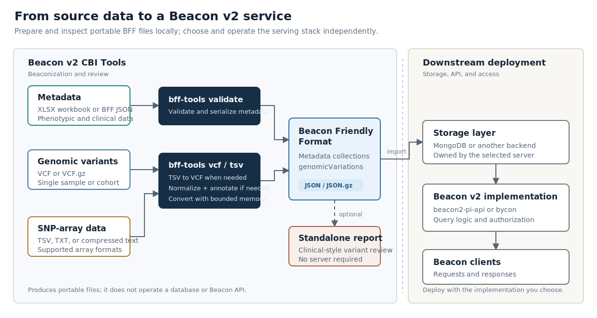

<div align="center">
  <a href="https://github.com/CNAG-Biomedical-Informatics/beacon2-cbi-tools">
    
  </a>
  <h1>Beacon v2 CBI Tools</h1>
</div>

[](https://github.com/CNAG-Biomedical-Informatics/beacon2-cbi-tools/actions/workflows/build-and-test.yml)
[](https://github.com/CNAG-Biomedical-Informatics/beacon2-cbi-tools/actions/workflows/build-and-test.yml)
[](https://github.com/CNAG-Biomedical-Informatics/beacon2-cbi-tools/actions/workflows/docker-build-multi-arch.yml)
[](https://github.com/CNAG-Biomedical-Informatics/beacon2-cbi-tools/actions/workflows/documentation.yml)

[](https://github.com/CNAG-Biomedical-Informatics/beacon2-cbi-tools/blob/main/LICENSE)
[](https://hub.docker.com/r/manuelrueda/beacon2-cbi-tools/)
[](https://hub.docker.com/r/manuelrueda/beacon2-ri-tools/)
[](https://hub.docker.com/r/beacon2ri/beacon_reference_implementation/)


**Beacon v2 CBI Tools** prepares portable [Beacon Friendly Format (BFF)](https://docs.genomebeacons.org/models/) data for Beacon v2. Its command-line interface is called **`bff-tools`**. It validates phenotypic and clinical metadata, converts VCF or SNP-array TSV input into BFF `genomicVariations`, and can generate a standalone browser report.

**Beacon v2 CBI Tools** is the actively developed continuation of the original `beacon2-ri-tools` codebase, now developed at [CNAG Biomedical Informatics](https://www.cnag.eu) by its original developer.

The two historical image badges preserve the download record of earlier distributions; those images are deprecated for new installations.

The output remains independent of a particular Beacon server or database. For serving, consider the [Beacon v2 Production Implementation](https://github.com/EGA-archive/beacon2-pi-api) or [bycon](https://codeberg.org/Progenetix/bycon/).

**[Read the documentation](https://cnag-biomedical-informatics.github.io/beacon2-cbi-tools/)** for installation options, the quick start, the end-to-end tutorial, CLI reference, annotation resources, and troubleshooting.

## Install

```bash
python3 -m pip install beacon2-cbi-tools
```

Python 3.10 through 3.14 is supported. Docker, Apptainer, and source/HPC instructions are available in the [installation guide](https://cnag-biomedical-informatics.github.io/beacon2-cbi-tools/docs/getting-started/installation/).

Check the installation and run the packaged example without downloading annotation databases:

```bash
bff-tools doctor
bff-tools demo
```

## Data flow



## Roadmap

- Follow Beacon v2 developments, including VRS alignment.
- Move to Beacon v3 once the specification is finalized.

## Citation

If you use these tools in published work, please cite:

Rueda M, Ariosa R. "Beacon v2 Reference Implementation: a toolkit to enable federated sharing of genomic and phenotypic data." *Bioinformatics*, btac568. <https://doi.org/10.1093/bioinformatics/btac568>

## License

Written by Manuel Rueda, PhD, at [CNAG Biomedical Informatics](https://www.cnag.eu). Licensed under the GNU General Public License v3.0 or later; see [LICENSE](https://github.com/CNAG-Biomedical-Informatics/beacon2-cbi-tools/blob/main/LICENSE).
