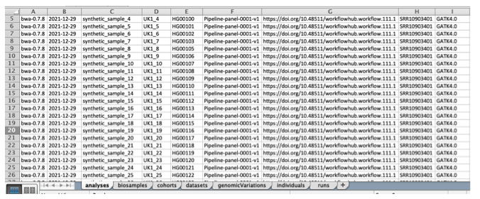
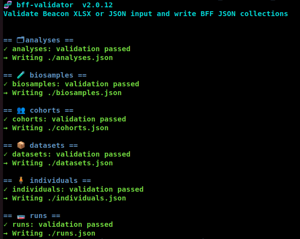
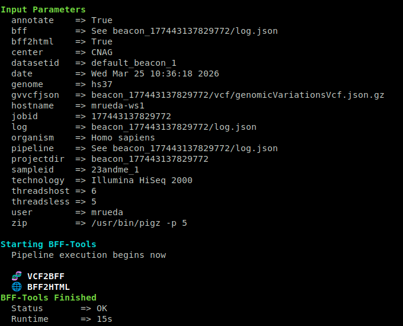

# Tutorial: Data Beaconization

This tutorial explains the typical end-to-end workflow for preparing Beacon v2 data with `beacon2-cbi-tools`.

Before starting, complete one of the installation guides:

- [Docker installation](download-and-installation/docker-based.md)
- [Apptainer installation](download-and-installation/apptainer-based.md)
- [Non-containerized installation](download-and-installation/non-containerized.md)

In the simplest case, you start with:

- metadata, including phenotypic or clinical information
- a VCF file or a SNP-array TSV file

## Workflow overview

Most users follow these three steps:

1. Validate metadata and generate BFF JSON collections.
2. Convert genomic input into BFF `genomicVariations`.
3. Load the resulting BFF collections into MongoDB.

## Optional first step: open the runtime environment

If you installed the toolkit with Docker and the container is already running:

```bash
docker exec -ti beacon2-cbi-tools bash
```

If you are using Apptainer or a non-containerized installation, adapt the commands below to your own environment.

## Step 1: validate metadata

Metadata is usually prepared in an XLSX workbook that follows the Beacon v2 data model. The toolkit validates that workbook and converts it into BFF JSON collections.

As input, you can use the provided template:

- [Beacon-v2-Models template](https://github.com/mrueda/beacon2-cbi-tools/blob/main/utils/bff_validator/Beacon-v2-Models_template.xlsx)

You can also use the synthetic cohort workbook as a reference:

- [CINECA synthetic cohort workbook](https://github.com/mrueda/beacon2-cbi-tools/blob/main/CINECA_synthetic_cohort_EUROPE_UK1/Beacon-v2-Models_CINECA_UK1.xlsx)

!!! Important "About the XLSX template"
    The workbook contains sheets corresponding to Beacon entities such as `analyses`, `biosamples`, `cohorts`, `datasets`, `individuals`, and `runs`.

    Header names indicate structure:

    - `.` usually represents nested objects
    - `_` usually represents arrays

    In most workflows, users do not manually fill the `genomicVariations` sheet, because genomic variations are generated later from VCF or TSV input.

Map your local metadata into the workbook and then validate it:



```bash
bin/bff-tools validate -i your_metadata.xlsx --out-dir your_bff_dir
```

If validation succeeds, the tool writes BFF JSON collections to `your_bff_dir`.



### Common validation behavior

- Errors usually indicate missing required fields, invalid values, or formatting mismatches.
- Warnings may also appear, especially around evolving schema rules such as some `oneOf` validations.
- It is normal to run validation multiple times while refining the workbook.

??? Warning "Example errors"

    **Example 1**

    ```text
    Row 1:
    /ethnicity/id: String does not match ^\w[^:]+:.+$.
    ```

    This usually means the value does not follow the expected CURIE format.

    **Example 2**

    ```text
    Row 1:
    /id: Missing property.
    ```

    This means a required `id` field is missing.

    **Example 3: warning rather than error**

    ```text
    Row 1:
    /diseases/0/ageOfOnset: oneOf rules 0, 1 match.
    ```

    Some schema warnings are expected and can reflect ambiguity in the current schema definitions rather than bad input data.

!!! Danger "About Unicode and debugging"
    Unicode input is allowed. If validation errors are difficult to interpret, you can use `--ignore-validation` to inspect the generated JSON output and then correct the source workbook before validating again normally.

At the end of this step, you typically have several metadata JSON collections in BFF format.

## Step 2: convert genomic data

The second step is to generate BFF `genomicVariations` from genomic input.

### VCF input

Use `bff-tools vcf` for VCF or VCF.gz input:

```bash
bin/bff-tools vcf -t 4 -i input.vcf.gz -p param_file.yaml
```

Minimal parameter file example:

```yaml
genome: hs37
```

If you also want HTML output for later browsing with `bff-browser`:

```yaml
genome: hs37
bff2html: true
```

!!! Important "About reference genomes"
    Make sure the genome in the parameter file matches the genome used to produce the VCF. Common values are `hg19`, `hg38`, `hs37`, and `b37`.

!!! Important "About supported VCF content"
    The workflow is aimed at DNA sequencing VCFs such as WES, WGS, and panel data. Structural variants and copy number variation support are still limited.



### SNP-array TSV input

Use `bff-tools tsv` for SNP-array style TSV or TXT input:

```bash
bin/bff-tools tsv -i input.txt.gz -p param_file.yaml
```

This mode is useful for microarray-style data such as 23andMe exports.

### Notes on runtime and disk usage

- Processing time depends on both the number of variants and the number of samples.
- During VCF processing, several intermediate files may be created.
- Plan disk space generously. Temporary and output files can be several times larger than the original input.

At the end of this step, you should have the genomic variations BFF output, typically under a run-specific project directory such as:

```text
beacon_XXXXXXX/vcf/genomicVariationsVcf.json.gz
```

## Step 3: load BFF collections into MongoDB

Once you have both:

- the metadata BFF collections from Step 1
- the genomic variations BFF output from Step 2

you can load them into MongoDB with `bff-tools load`.

Example parameter file:

```yaml
bff:
  metadatadir: my_bff_dir
  runs: runs.json
  cohorts: cohorts.json
  biosamples: biosamples.json
  individuals: individuals.json
  analyses: analyses.json
  datasets: datasets.json
  genomicVariationsVcf: beacon_XXXXXXX/vcf/genomicVariationsVcf.json.gz
```

Run the load step:

```bash
bin/bff-tools load -p param_file.yaml
```

If everything is configured correctly, the BFF collections will be ingested into MongoDB.

!!! Important "About MongoDB"
    The `load` step performs ingestion and indexing. Once data is in MongoDB, you can explore it with `mongosh`, Mongo Express, your own MongoDB clients, or optional utilities such as `bff-portal`.

## Optional alternative: use `full`

If you want to combine conversion plus loading in a single command, use:

```bash
bin/bff-tools full -i input.vcf.gz -p param_file.yaml
```

This is convenient when your metadata files are already prepared and your parameter file already points to the correct BFF inputs.

## Optional browsing and follow-up

After data preparation:

- use `bff-browser` if you want lightweight browsing of static BFF output
- use `bff-portal` if you want live queries over MongoDB
- use `bff-queue` if you need to run many jobs on a workstation

## Summary

The standard workflow is:

1. validate metadata with `bff-tools validate`
2. convert genomic data with `bff-tools vcf` or `bff-tools tsv`
3. ingest everything into MongoDB with `bff-tools load` or `bff-tools full`

If you get stuck on installation details or edge cases, continue with the [FAQ](help/faq.md).
