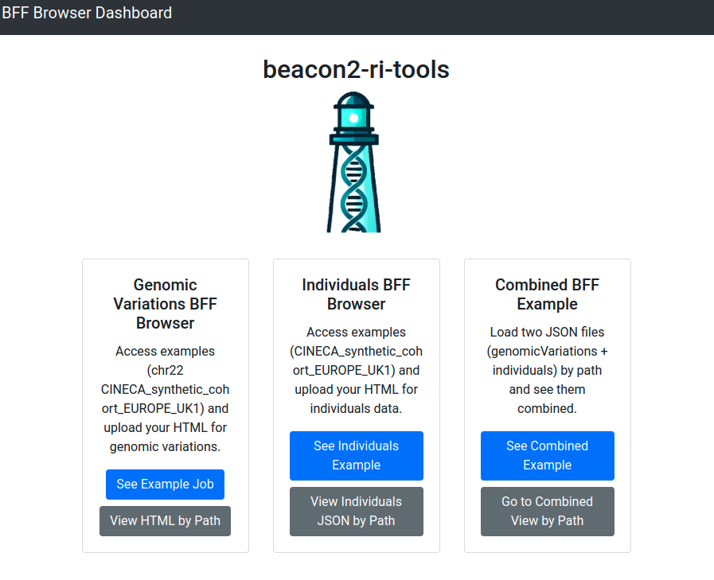
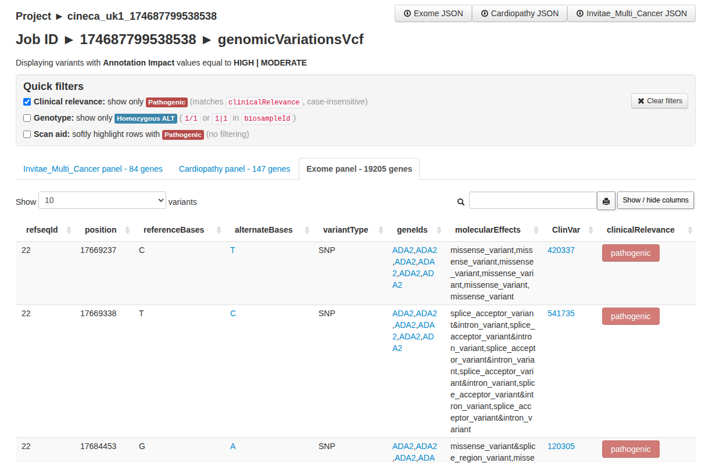
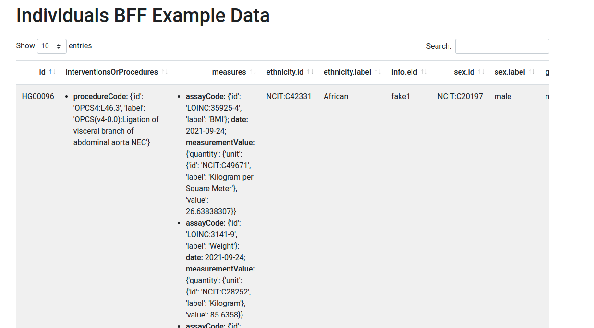
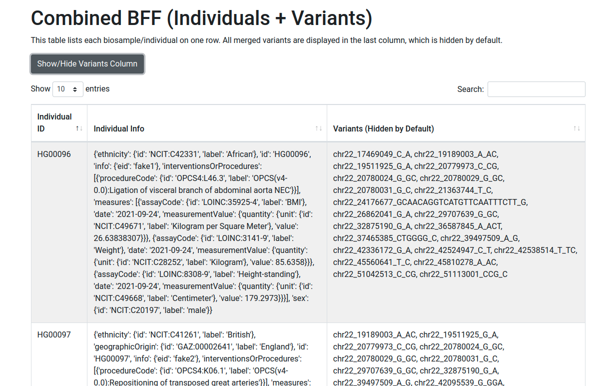

# BFF Browser

`bff-browser` is a lightweight web application for browsing BFF data without a database. It works with `genomicVariations`, `individuals`, and a combined view built from both.



## Install

If `beacon2-cbi-tools` is already installed, no extra setup may be needed. Otherwise:

```bash
pip install -r requirements.txt
```

## Run

```bash
cd utils/bff_browser
python3 app.py
```

Then open <http://0.0.0.0:8001>.

The application includes example data from `CINECA_synthetic_cohort_EUROPE_UK1`.

## Browse `genomicVariations`

To create the browser input during a `bff-tools vcf` run, enable:

```yaml
bff2html: true
```

Example:

```bash
bff-tools vcf -i my.vcf.gz -p param.yaml
```

After the run, the generated HTML page is available under:

```text
<job_id>/browser/<job_id>.html
```

This mode works well for small or medium datasets. For larger datasets or live querying, prefer `bff-portal`.

### Features

- searchable and sortable tables
- gene panel tabs based on `.lst` files in the configured `paneldir`
- quick filters for common clinical review tasks
- pagination, column visibility, and printable views



## Browse `individuals`

Load an `individuals.json` file to inspect individuals interactively in the browser.



## Combined view

The combined view links `genomicVariations` with `individuals` by individual or biosample identifiers.

- provide the paths to both JSON files
- open the merged table view
- search, paginate, and optionally hide the variations column


