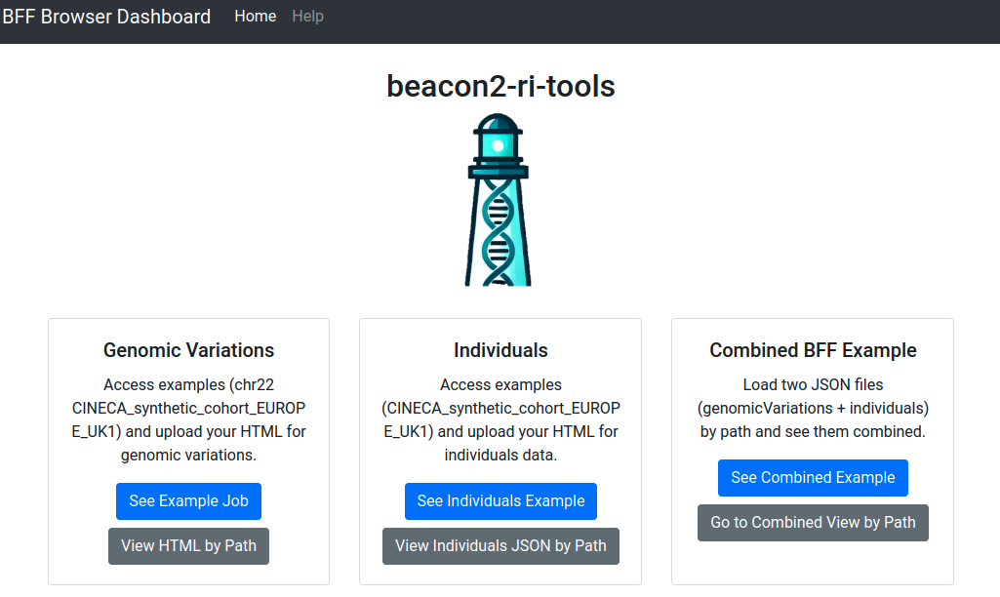

# BFF Browser

## Overview  
The BFF Browser is an application that displays BFF files as interactive HTML. It works with the entities `genomicVariations` and `individuals`.



## Installation  
If you have already installed `beacon2-ri-tools`, the App should be installed automatically. If not, ensure you have Python 3 installed and then use the provided `requirements.txt` to install necessary dependencies:

```bash
pip install -r requirements.txt
```

## How to Run  
1. Navigate to the App folder:
    ```bash
    cd utils/browser
    ```
2. Run the application:
    ```bash
    python3 app.py
    ```

   Note that you can run it from any other directory too.

3. Open your web browser and go to:
    ```
    http://0.0.0.0:8000
    ```

The App includes precomputed examples for `genomicVariations` and `individuals` extracted from the **CINECA_synthetic_cohort_EUROPE_UK1** dataset.

---

## Browsing `genomicVariations`

To visualize **genomic variations**, an **HTML** file needs to be created and later loaded into the **BFF Browser**. The process involves filtering variants with **HIGH** quality from the `JSON` file and rendering them in HTML using `JavaScript`.

**Note:** This method works efficiently for up to **5 million** variants. If your dataset exceeds this limit, consider using an alternative visualization method based on a backend database.

### Preparing the Files  

To generate the necessary files, update your parameters file at the time you **process your VCF** using the following command:

Example:

```bash
beacon vcf -i my.vcf -p param.yaml
```

Ensure your `param.yaml` includes:

```yaml
bff2html: true
```

This will turn off the pipeline **bff2html**.

By default, the browser processes all `.lst` files in the `paneldir` folder. The `paneldir` folder is set at the `beacon` **configuration file**. You can include your own panels if needed. 


Once [beacon script](../bin/README.md) has finished, a static HTML page will be available as `<job_id>/browser/<job_id>.html` directory. This page serves as the input for the **BFF Browser**.

### Features  

1. **Gene Panel Support**  
   - Variations are displayed in **HTML tabs** organized by gene panels.
   - **Gene Panels**: Simple text files with a `.lst` extension containing a list of gene names.
   - **Default Directory**: `$beacon_path/browser/data`.
   - **Customization**: Modify the directory using the `paneldir` parameter in the `config.yaml` file.
   - **Extendability**: You can create and add additional gene panels.

2. **Dynamic Tables**  
   - The browser generates searchable and sortable tables directly in HTML.
   - **Key Features**:
     - Column reordering.
     - Advanced search with regular expressions (e.g., `rs12(3|4) (tp53|ace2) splice`).

3. **Filtered Display**
   - Only variations with a **HIGH** impact annotation are included.
   - Variations are filtered and displayed according to the `.lst` files in the `paneldir` folder.


---

## Browsing `individuals`

When browsing `individuals`, the input file should be a JSON file (e.g., `individuals.json`). The browser will handle this file to display the relevant data interactively.


## New Feature: Combined Genomic Variations & Individuals Search

- Merge genomic variant data with individual biosample data.
- **Client-based** interactive, searchable, and paginated table view.
- Toggle visibility of the variations column.

## How to Use

1. **Combined View by Path**  
   - Enter paths for `genomicVariations` and `individuals` JSON files.  
   - View combined results.

2. **Combined Example**  
   - See a demo with sample data.

## Key Features

- Cross-linked data by Individuals ID.  
- Toggleable variations column.  
- Pagination and search for large datasets.


## How BFF Browser Differs from BFF Portal

The **BFF Browser** and **BFF Portal** serve different purposes within the BFF ecosystem. Below is a detailed comparison to clarify their distinct functionalities:

| Feature                      | **BFF Browser**                           | **BFF Portal**                        |
|------------------------------|-------------------------------------------|--------------------------------------|
| **Data Source**              | Static JSON files (`genomicVariations`, `individuals`) | Live data from MongoDB database |
| **Technology Stack**         | Python + Flask (Client-Side)              | Perl + Mojolicious (Backend API + UI) |
| **Data Handling**            | Precomputed HTML pages                    | Dynamic, real-time data querying     |
| **Query Capability**         | No live queries, only filtering of static data | Supports flexible, live queries via API |
| **Cross-Collection Queries** | ❌ Only combined JSON files data         | ✅ Supported (e.g., individuals ↔ genomicVariations) |
| **Pagination**               | Static, loaded in full                   | Dynamic, with `limit` and `skip` support |
| **Scalability**              | Best for small/medium datasets (~5 million variants) | Handles larger datasets efficiently via MongoDB |
| **Usage**                    | Quick data exploration with static files  | Interactive data exploration with live queries |
| **Deployment**               | Lightweight, no database required         | Requires MongoDB backend for live data |
| **Intended Users**           | Users needing quick, offline browsing     | Users needing live, flexible data querying |

### When to Use Each Tool

- **Use BFF Browser if:**  
  - You need a lightweight, client-side tool for browsing precomputed data.  
  - Your datasets are static and do not change frequently.  
  - You want a simple setup without needing a database.

- **Use BFF Portal if:**  
  - You need to perform live queries on dynamic datasets stored in MongoDB.  
  - You require cross-collection querying and pagination for large datasets.  
  - You need a web interface that allows flexible data exploration and visualization.

### Future Integration

While the BFF Browser and BFF Portal currently serve separate use cases, there are plans to merge their functionalities in the future. This would combine the simplicity of static data browsing with the flexibility and power of dynamic, database-driven queries into a single, unified platform.
