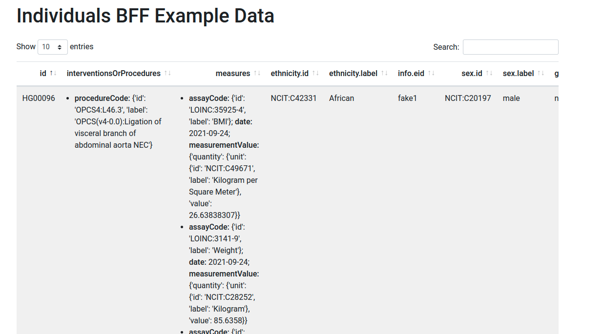

# BFF Browser

## Overview  
The BFF Browser is an application that displays BFF files as interactive HTML. It works with the entities `genomicVariations` and `individuals`.


## Installation  
If you have already installed `beacon2-cbi-tools`, the App should be installed automatically. If not, ensure you have Python 3 installed and then use the provided `requirements.txt` to install necessary dependencies:

```bash
pip install -r requirements.txt
```

## How to Run  
1. Navigate to the App folder:
    ```bash
    cd utils/browser
    ```
2. Run the application:
    ```bash
    python3 app.py
    ```

   Note that you can run it from any other directory too.

3. Open your web browser and go to:
    ```
    http://0.0.0.0:8001
    ```

The App includes precomputed examples for `genomicVariations` and `individuals` extracted from the **CINECA_synthetic_cohort_EUROPE_UK1** dataset.

---

## Browsing `genomicVariations`

To visualize **genomic variations**, an **HTML** file needs to be created and later loaded into the **BFF Browser**. The process involves filtering variants with **HIGH|MODERATE** annotation from the `JSON` file and rendering them in HTML using `JavaScript`.

**Note:** This method works efficiently for up to **5 million** variants. If your dataset exceeds this limit, consider using an alternative visualization method based on a backend database.

### Preparing the Files  

To generate the necessary files, update your parameters file at the time you **process your VCF** using the following command:

Example:

```bash
beacon vcf -i my.vcf -p param.yaml
```

Ensure your `param.yaml` includes:

```yaml
bff2html: true
```

This will turn off the pipeline **bff2html**.

By default, the browser processes all `.lst` files in the `paneldir` folder. The `paneldir` folder is set at the `beacon` **configuration file**. You can include your own panels if needed. 


Once [beacon script](../bin/README.md) has finished, a static HTML page will be available as `<job_id>/browser/<job_id>.html` directory. This page serves as the input for the **BFF Browser**.

### Features  

1. **Gene Panel Support**  
   - Variations are displayed in **HTML tabs** organized by gene panels.
   - **Gene Panels**: Simple text files with a `.lst` extension containing a list of gene names.
   - **Default Directory**: `$beacon_path/browser/data`.
   - **Customization**: Modify the directory using the `paneldir` parameter in the `config.yaml` file.
   - **Extendability**: You can create and add additional gene panels.

2. **Dynamic Tables**  
   - The browser generates searchable and sortable tables directly in HTML.
   - **Key Features**:
     - Column reordering.
     - Advanced search with regular expressions (e.g., `rs12(3|4) (tp53|ace2) splice`).

3. **Filtered Display**
   - Only variations with a **HIGH** impact annotation are included.
   - Variations are filtered and displayed according to the `.lst` files in the `paneldir` folder.


---

## Browsing `individuals`

When browsing `individuals`, the input file should be a JSON file (e.g., `individuals.json`). The browser will handle this file to display the relevant data interactively.




## New Feature: Combined Genomic Variations & Individuals Search

- Merge genomic variant data with individual biosample data.
- **Client-based** interactive, searchable, and paginated table view.
- Toggle visibility of the variations column.

## How to Use

1. **Combined View by Path**  
   - Enter paths for `genomicVariations` and `individuals` JSON files.  
   - View combined results.

2. **Combined Example**  
   - See a demo with sample data.

## Key Features

- Cross-linked data by Individuals ID.  
- Toggleable variations column.  
- Pagination and search for large datasets.


